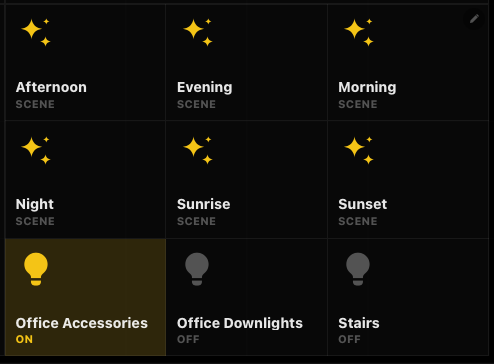
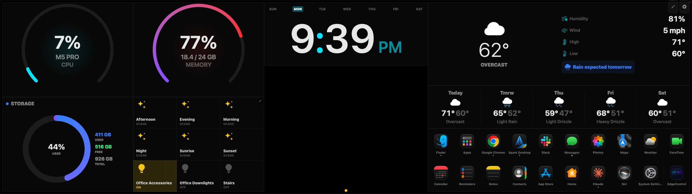

# Home Assistant Buttons for EdgeControl

An [EdgeControl](https://github.com/kemalandic/edgecontrol) plugin that puts tap-to-run buttons for your Home Assistant scenes, scripts, automations and devices on the dashboard, with live state. Built for the CORSAIR Xeneon Edge, but it works on any EdgeControl display.



It's styled after EdgeControl's own widgets, not Home Assistant's, and follows your Theme settings:
- **Font:** your font family (Rounded, System, Monospaced or Serif), sizes and font scale.
- **Cards:** Widget Opacity, Corner Radius, border and Widget Gap, built the same way as native widget cards.
- **Accent:** Theme accent by default, or any of EdgeControl's named colours per tile.
- **Look:** a "● Title" header, left-aligned content, filled SF Symbols-style icons, and capsule tabs.

Here it is on a Xeneon Edge, beside EdgeControl's built-in widgets and the [App Drawer](https://github.com/phillywebteam/edgecontrol-app-drawer):



Sibling plugin: [App Drawer](https://github.com/phillywebteam/edgecontrol-app-drawer).

## Install

**Easiest:** download **HomeAssistant.ecplugin.zip** from the [latest release](https://github.com/phillywebteam/edgecontrol-homeassistant/releases/latest), then in EdgeControl open Settings → Plugins → **Install Plugin** and choose the zip.

**Or from source:**

Requires EdgeControl 2.5.0 or later.

```bash
git clone https://github.com/phillywebteam/edgecontrol-homeassistant.git
cd edgecontrol-homeassistant
tools/install.sh
```

This copies `HomeAssistant.ecplugin` into `~/Library/Application Support/EdgeControl/Plugins/` and restarts EdgeControl. You can also install the folder through EdgeControl Settings → Plugins → Install Plugin.

## Set up a tile

1. In Home Assistant, open your profile → **Security** → **Long-lived access tokens** → **Create token**.
2. In EdgeControl, add **Home Assistant Buttons** from the widget catalog (Settings → Pages).
3. Right-click the tile → **Edit This Widget's Settings**. Enter:
   - **Home Assistant URL**, e.g. `https://homeassistant.example.com`. The `/api/websocket` path is added for you.
   - **Long-lived access token**.

   You only need to enter these on one tile. Other Buttons tiles with the URL and token left blank use the saved connection.
4. Tap **Choose buttons** (or the pencil in the corner). Pick from Scenes, Scripts, Automations and Devices, reorder under **Selected**, then tap **Done**.
   - **Search** (the magnifier) finds anything by name, room or entity id. The plugin can't take the Mac's keyboard, so it brings its own on-screen keyboard; its lowest key hides it to show more results.
   - **Rooms** groups the lists by Home Assistant area: an entity's own area, or its device's. The button appears when your Home Assistant shares its areas with the token.

## Settings

| Setting | What it does |
|---|---|
| Tile title | Optional. Shows a "● Title" header like native widgets. |
| Style | **Cards** (default): separate cards with the theme's gap. **Dividers**: buttons fill the tile edge to edge, separated by single thin lines. **Pills**: one-line capsules like Now Playing's source tabs. **Minimal**: icons and labels straight on the card; "on" lights the icon with a glow. **Tinted**: every button washed with the button colour, filled solid when on. |
| Button grid | **Auto** sizes buttons to fit the tile. A fixed layout like **4 × 2** is columns × rows. Extra buttons go on further pages: drag sideways or tap the dots. |
| Shared button set | Blank (the default): this tile keeps its own buttons. Tiles given the same name share one list. Tiles from before 1.5 were all named "Main"; that name now means the tile's own buttons, starting from what Main had. |
| Button color | **Theme accent** follows the accent on EdgeControl's Theme page. You can also pick one of EdgeControl's colours (Cyan, Blue, Purple, Green, Yellow, Orange, Red, Pink, White). |
| Show device state | Shows *On · 60%*, *Locked*, *Open* and so on under each name. |
| Tap twice to unlock or open doors | Unlocking a lock or opening a garage door, gate or door cover needs a second tap within 4 seconds. |

### What a tap does

| Entity | Action |
|---|---|
| Scene | `scene.turn_on` |
| Script | `script.turn_on` |
| Automation | `automation.trigger` |
| Button / input button | `press` |
| Lock | lock ↔ unlock |
| Cover | `cover.toggle` |
| Media player | play / pause |
| Lights, switches, fans, helpers, others | `homeassistant.toggle` |

## How it works

The plugin uses Home Assistant's WebSocket API with a long-lived access token, the same approach as [Itsyhome](https://github.com/nickustinov/itsyhome-macos). The plugin page loads from a `file://` URL, so Home Assistant's REST API would reject it on CORS. WebSockets aren't subject to CORS.

After a rejected token, the plugin stops retrying until the token changes, because repeated failed logins can get the Mac's IP address banned by Home Assistant.

**Security notes**
- EdgeControl stores widget settings, including the token, in plain text in `~/Library/Application Support/EdgeControl/layout.json`. The shared connection is a second plain-text copy in `PluginData/com.phillywebteam.homeassistant/storage.json`. Use a token you can revoke from your Home Assistant profile.
- Because the URL is a setting, the manifest doesn't restrict `allowedDomains`. The plugin only connects to the URL you enter.

### Why the colour isn't on the Theme page

EdgeControl 2.5.0 leaves plugin widgets out of Settings → Theme → Widget Colors, and its `color` field type for plugin settings doesn't render yet. So the colour is a dropdown in the tile's own settings. The **Theme accent** option keeps the tile tied to the Theme page.

## Touch

EdgeControl 2.5.0 sends its own touch input only to its built-in widgets. It doesn't forward taps into plugin widgets, though mouse clicks work everywhere.

For finger taps, let a system-wide touch driver own the panel instead. [xeneon-wch-touchscreen-driver-macos](https://github.com/mrnocreativity/xeneon-wch-touchscreen-driver-macos) turns taps into real clicks, and EdgeControl's built-in widgets and page swipes keep working with it.

Two things to know:
- **Startup order:** only one process can hold the touch panel, and the first to start wins. Start the driver before EdgeControl, for example by turning off EdgeControl's Launch at login and opening it after the driver.
- **First tap:** macOS spends the first click on an inactive app's window activating it, and web views (which plugins run in) ignore that click. So plugin buttons need two taps unless the driver brings the tapped window's app to the front before clicking.

## Development

```bash
cd dev && npm install && npm start
```

Then open http://localhost:8124/dev/preview.html (add `?view=styles` for every style). It runs a mock Home Assistant on the same port (token `dev-token`) and shows the widget at several real tile sizes. Opening `HomeAssistant.ecplugin/widget.html` directly in a browser also works with `?url=…&token=…&layout=…&set=…`.

`ec-common.js`, `base.css` and `picker.css` are shared with the sibling plugin: EdgeControl only lets a plugin load files from inside its own bundle, so each repo carries a copy. Keep them identical across the repos.

## License

[MIT](LICENSE)
